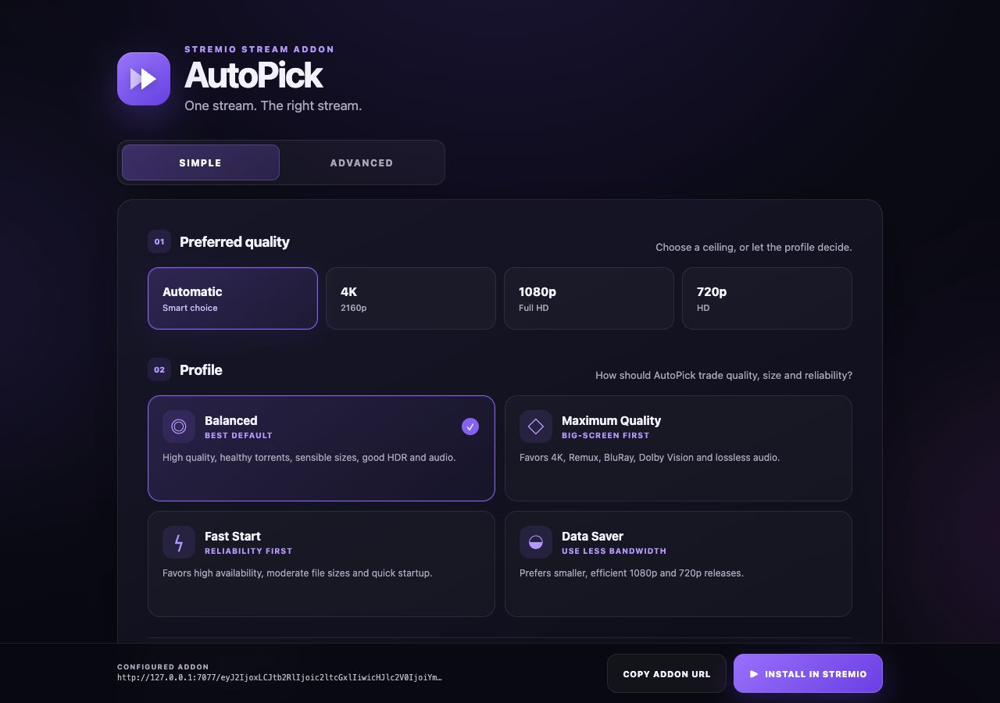

<p align="center">
  
</p>

<h1 align="center">AutoPick</h1>

<p align="center"><strong>One stream. The right stream.</strong></p>

I built AutoPick because choosing a torrent in Stremio should not mean comparing twenty nearly identical release names.

You set your preferences once, open a movie or episode, and AutoPick returns one clean **▶ PLAY** result. It quietly handles the quality, size, HDR, audio and availability checks in the background.

No account, login, database, debrid service, subscription or API key is needed.



## What it does

- Works with movies and series using IMDb-style `tt` IDs.
- Collects torrent streams from Stremio addons you choose.
- Understands common release names, resolutions, HDR formats, codecs, audio and languages.
- Removes duplicate torrents before ranking them.
- Rejects hard limits first, then scores everything that remains.
- Returns one **▶ PLAY** stream by default.
- Can show up to three manual backups if you want them.
- Stores settings inside the configured addon URL, so there are no user accounts to manage.

## Quick start

You need Node.js 20 or newer.

```bash
git clone https://github.com/Sophie97x/stremio-autopick.git
cd stremio-autopick
npm install
cp .env.example .env
npm run dev
```

Open [http://127.0.0.1:7000/configure](http://127.0.0.1:7000/configure), choose a profile and press **Install in Stremio**.

Port 7000 is sometimes already used by AirPlay on macOS. If that happens, use:

```bash
PORT=7077 BASE_URL=http://127.0.0.1:7077 npm run dev
```

Then open [http://127.0.0.1:7077/configure](http://127.0.0.1:7077/configure).

## Add a torrent source

AutoPick does not include a general torrent index.

To use it with your own lawful sources:

1. Open the configuration page.
2. Choose **Advanced**.
3. Open **Torrent sources**.
4. Add the manifest URL of another Stremio stream addon.
5. Save by installing the newly generated AutoPick URL.

Remote source URLs must use HTTPS. Localhost HTTP is allowed during development.

The included demo source only exists so the project can be tested with public-domain material. Try IMDb ID `tt1254207` while it is enabled.

## Profiles

| Profile | Best for |
| --- | --- |
| **Balanced** | The best everyday mix of quality, reliability and sensible file size |
| **Maximum Quality** | 4K, Remux, BluRay, HDR and lossless audio, with much larger files allowed |
| **Fast Start** | Healthy torrents, smaller files and quicker startup |
| **Data Saver** | Smaller 1080p and 720p releases with efficient codecs |

Every profile can be adjusted in Advanced mode.

## How AutoPick chooses

```text
Search → Normalise → Parse → Dedupe → Hard filter → Score → Preflight → Select
```

Hard rules are handled first. A blocked codec, CAM release, wrong episode or file over the hard size limit cannot win by getting a high score somewhere else.

The remaining releases are scored separately for:

- resolution
- HDR format
- release quality
- video codec
- audio
- availability
- file size
- source priority
- language
- preflight health

Availability uses diminishing returns, so moving from 1 to 10 seeders matters much more than moving from 501 to 510. If two releases are very close, AutoPick prefers the healthier and smaller sensible option.

## Series and season packs

AutoPick recognises normal episode names such as `S02E06` and `2x06`.

Season packs and full-series packs are only accepted when the upstream addon supplies a `fileIdx` for the requested episode. If the correct file cannot be identified safely, the torrent is rejected instead of guessing.

## Settings and privacy

Configuration is versioned JSON encoded as Base64URL:

```text
https://your-domain.example/<encoded-settings>/manifest.json
```

There are no cookies or saved user profiles. Settings can also be exported and imported as JSON.

Do not put passwords, private API keys or secret tokens in an upstream URL. Anyone with the configured addon URL can decode its settings.

> **P2P warning:** Torrent streaming connects directly to other peers and can expose your IP address to those peers. AutoPick does not provide anonymity.

## Docker

```bash
cp .env.example .env
docker compose up -d --build
docker compose logs -f autopick
```

Stop it with:

```bash
docker compose down
```

If port 7000 is busy:

```bash
PORT=7077 BASE_URL=http://127.0.0.1:7077 docker compose up -d --build
```

## Useful commands

```bash
npm run dev        # development server
npm run typecheck  # TypeScript checks
npm run lint       # lint source and tests
npm test           # unit and integration tests
npm run build      # production build
npm start          # run the production build
```

## Public hosting

A public Stremio addon needs a stable HTTPS address. Set `BASE_URL` to the exact public origin before starting it:

```bash
BASE_URL=https://your-domain.example docker compose up -d --build
```

`Caddyfile.example` contains a small reverse-proxy example that handles HTTPS.

Check the deployment before publishing:

```bash
curl -fsS https://your-domain.example/healthz
curl -fsS https://your-domain.example/manifest.json
```

Then submit the root manifest to Stremio:

```bash
PUBLIC_MANIFEST_URL=https://your-domain.example/manifest.json npm run publish:addon
```

Publish the root `/manifest.json`, not a personal configured URL. The public listing sends each person to `/configure` so they can create their own settings.

## Environment variables

| Variable | Default | What it controls |
| --- | --- | --- |
| `PORT` | `7000` | Server port |
| `BASE_URL` | `http://127.0.0.1:7000` | Public origin used in generated addon URLs |
| `NODE_ENV` | `development` | Development or production safety mode |
| `LOG_LEVEL` | `info` | Operational log detail |
| `PREFLIGHT_ENABLED` | `false` | Checks the best candidates before returning one |
| `PREFLIGHT_TIMEOUT_MS` | `3000` | Timeout for each health check |
| `PREFLIGHT_MAX_CANDIDATES` | `3` | Maximum candidates checked by the server |
| `ENABLE_DEBUG` | `false` | Enables ranking debug endpoints |
| `UPSTREAM_TIMEOUT_MS` | `2500` | Timeout for each upstream addon |
| `UPSTREAM_MAX_RESPONSE_BYTES` | `1048576` | Maximum upstream JSON response size |

## Debug ranking

Debug endpoints are off by default. Enable them on a private development instance:

```bash
ENABLE_DEBUG=true npm run dev
```

```text
/<encoded-settings>/debug/rank/movie/tt1254207
```

The response explains every score and hard rejection.

## Adding another source adapter

1. Implement `TorrentSourceAdapter` from `src/sources/types.ts`.
2. Convert results into the shared `StreamCandidate` model.
3. Use `parseReleaseName()` for release text.
4. Register the adapter in `DiscoveryService.adapters()`.
5. Add fixtures and an integration test.

Source-specific logic stays inside the adapter. The ranking engine does not need to know where a torrent came from.

## Security

User-supplied upstream URLs are protected against server-side request forgery:

- HTTPS is required remotely.
- DNS results and redirects are checked again.
- Private, loopback, link-local, reserved and metadata addresses are blocked in production.
- Responses must be JSON and stay within time and size limits.
- One broken source does not break the whole stream request.

## Current limits

- Preflight currently uses availability reported by upstream sources. It does not perform full tracker, DHT or peer handshakes.
- AutoPick cannot switch to a different video release halfway through playback.
- Seeder counts are missing or inaccurate in some upstream addons.
- Pack selection depends on an episode-specific `fileIdx` from the upstream addon.
- Direct HTTP video streams are ignored; AutoPick ranks torrent `infoHash` streams.
- Caches are kept in memory and reset when the server restarts.

## Legal note

AutoPick is a stream-ranking tool. It does not include unauthorised content indexes. Use sources and content you are legally allowed to access.

## License

MIT
